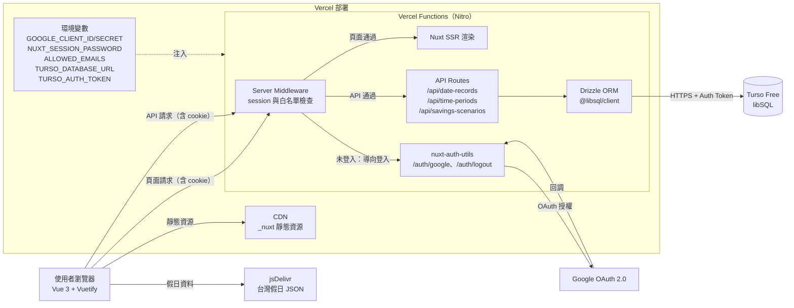

# 系統架構圖

```mermaid
flowchart LR
  U["使用者瀏覽器<br/>Vue 3 + Vuetify"]
  JSD["jsDelivr<br/>台灣假日 JSON"]
  GOOGLE["Google OAuth 2.0"]
  TURSO[("Turso Free<br/>libSQL")]

  subgraph VERCEL["Vercel 部署"]
    CDN["CDN<br/>_nuxt 靜態資源"]
    subgraph FN["Vercel Functions（Nitro）"]
      MW["Server Middleware<br/>session 與白名單檢查"]
      SSR["Nuxt SSR 渲染"]
      AUTH["nuxt-auth-utils<br/>/auth/google、/auth/logout"]
      API["API Routes<br/>/api/date-records<br/>/api/time-periods<br/>/api/savings-scenarios"]
      ORM["Drizzle ORM<br/>@libsql/client"]
    end
    ENV["環境變數<br/>GOOGLE_CLIENT_ID/SECRET<br/>NUXT_SESSION_PASSWORD<br/>ALLOWED_EMAILS<br/>TURSO_DATABASE_URL<br/>TURSO_AUTH_TOKEN"]
  end

  U -->|"靜態資源"| CDN
  U -->|"頁面請求（含 cookie）"| MW
  U -->|"API 請求（含 cookie）"| MW
  U -->|"假日資料"| JSD
  MW -->|"未登入：導向登入"| AUTH
  MW -->|"頁面通過"| SSR
  MW -->|"API 通過"| API
  AUTH -->|"OAuth 授權"| GOOGLE
  GOOGLE -->|"回調"| AUTH
  API --> ORM
  ORM -->|"HTTPS + Auth Token"| TURSO
  ENV -.->|"注入"| FN
```
